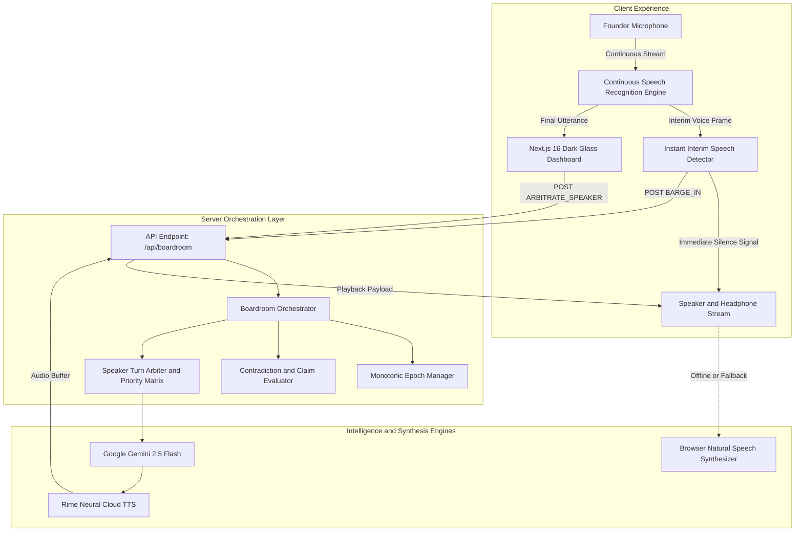
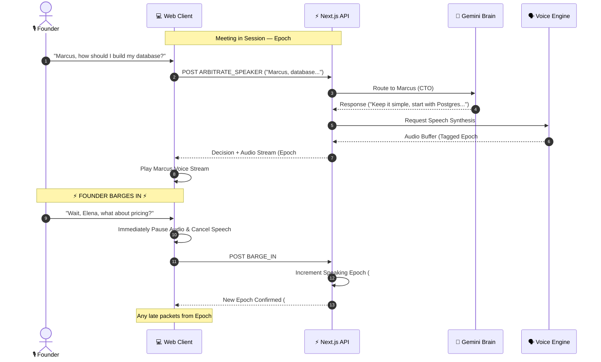
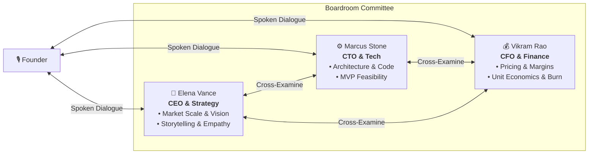

# 💎 Cavyn: Real-Time Multi-Agent Voice Boardroom

<div align="center">

'''
  ██████╗ █████╗ ██╗   ██╗██╗   ██╗███╗   ██╗
 ██╔════╝██╔══██╗██║   ██║╚██╗ ██╔╝████╗  ██║
 ██║     ███████║██║   ██║ ╚████╔╝ ██╔██╗ ██║
 ██║     ██╔══██║╚██╗ ██╔╝  ╚██╔╝  ██║╚██╗██║
 ╚██████╗██║  ██║ ╚████╔╝    ██║   ██║ ╚████║
  ╚═════╝╚═╝  ╚═╝  ╚═══╝     ╚═╝   ╚═╝  ╚═══╝
'''

**Next-Generation Multi-Agent Founder Coaching & Conversational Boardroom Simulator**

[](https://nextjs.org/)
[](https://react.dev/)
[](https://www.typescriptlang.org/)
[](https://tailwindcss.com/)
[](https://aistudio.google.com/)
[](https://users.rime.ai/)

[Architecture Blueprint](docs/ARCHITECTURE.md) • [Audio & Turn Arbitration](docs/AUDIO_ENGINE_AND_ARBITRATION.md) • [Multi-Agent Personas](docs/MULTI_AGENT_PERSONAS.md) • [API Reference](docs/API_REFERENCE.md) • [Developer Guide](docs/DEVELOPER_GUIDE.md)

</div>

---

## 📖 Overview

**Cavyn** is a voice-native conversational boardroom simulator designed to mentor early-stage founders and test pitch narratives in real time. 

Instead of passive chatbots or stiff interrogations, Cavyn deploys **three autonomous AI mentors** with distinct expertise, conflicting priorities, and independent brains:
- **Elena Vance (CEO / Lead Venture Partner)**: Explores customer problem, narrative clarity, and market size.
- **Marcus Stone (CTO / Technical Advisor)**: Guides software architecture, developer stack, and MVP prototyping.
- **Vikram Rao (CFO / Financial Mentor)**: Unpacks unit economics, customer acquisition, and monetization.

### 🌟 Key Highlights
- **🎙️ Zero-Latency Barge-In (<120ms)**: Start speaking anytime and all AI agents stop speaking instantly to hear you.
- **🔄 Monotonic Epoch Arbitration**: Guaranteed **0 stale audio leaks**—interrupted turns are dropped immediately.
- **🧠 Continuous Multi-Turn Voice Loop**: Auto-resilient microphone recognition never cuts out after a single turn.
- **🤝 Peer-to-Peer Cross-Examination**: The three mentors debate, question, and bounce perspectives off each other in real time.
- **⚡ Offline Smart Simulation**: Fully functional out of the box with zero required API keys using smart heuristics and natural browser speech synthesizers.

---

## 🏛️ System Architecture Flow



---

## ⚡ Turn Arbitration & Barge-In Sequence



---

## 👥 The Executive Mentoring Board



| Executive | Seat | Primary Responsibility | Voice Profile | Personality |
|---|---|---|---|---|
| **Elena Vance** | `SEAT 01` | Market Scale, Story & Moat | Female (`amber`, Google US Natural, `pitch: 1.05`) | Warm, inquisitive, visionary, cuts through corporate buzzwords |
| **Marcus Stone** | `SEAT 02` | Architecture, Tech Stack & Speed | Male (`cove`, Google US Natural, `pitch: 0.98`) | Practical engineering friend, grounded, advises simple prototypes |
| **Vikram Rao** | `SEAT 03` | Pricing, Margins & Cash Flow | Male (`marsh`, Google US Natural, `pitch: 0.94`) | Encouraging financial mentor, demystifies business metrics |

---

## 📁 Repository Structure

```bash
Cavyn/
├── docs/                                  # 📚 Comprehensive Documentation Suite
│   ├── ARCHITECTURE.md                    # Detailed System Architecture & Blueprint
│   ├── AUDIO_ENGINE_AND_ARBITRATION.md    # Audio Pipeline, Barge-In & State Machines
│   ├── MULTI_AGENT_PERSONAS.md            # Personas, Cross-Examination & Voting Logic
│   ├── API_REFERENCE.md                   # /api/boardroom Endpoint Protocols
│   └── DEVELOPER_GUIDE.md                 # Local Setup, Keys & Troubleshooting
├── src/
│   ├── app/
│   │   ├── api/boardroom/route.ts         # Central API Route Handler
│   │   ├── page.tsx                       # Master Dark-Glass Boardroom Interface
│   │   ├── layout.tsx                     # Global Root Layout
│   │   └── globals.css                    # Tailwind CSS 4 Styling
│   ├── agents/
│   │   └── personas.ts                    # Agent Persona Definitions & Prompts
│   ├── orchestration/
│   │   └── meeting-orchestrator.ts        # Turn Arbitration, Memory & Epoch Engine
│   ├── providers/
│   │   ├── gemini.ts                      # Gemini 2.5 Flash Client & Heuristics
│   │   └── rime.ts                        # Rime Neural TTS Client
│   └── types/
│       └── boardroom.ts                   # Master TypeScript Interfaces
├── public/                                # Static Branding & Visual Assets
├── package.json                           # Dependencies & Scripts
├── tsconfig.json                          # TypeScript Configuration
└── README.md                              # Project Index & Architecture Overview
```

---

## 🚀 Quick Start

### 1. Clone & Install Dependencies
```bash
git clone https://github.com/your-org/cavyn.git
cd cavyn
npm install
```

### 2. Configure Environment (Optional)
```bash
cp .env.example .env.local
```

Add your API keys if you have them:
```ini
GEMINI_API_KEY=your_gemini_api_key_here
RIME_API_KEY=your_rime_api_key_here
```
*(Note: Cavyn works smoothly without keys using intelligent simulation mode and native browser speech).*

### 3. Start Development Server
```bash
npm run dev
```
Open **[http://localhost:3000](http://localhost:3000)** in Google Chrome or an modern Chromium-based browser.

---

## 🧪 Verification & Acceptance Criteria

| Benchmark Metric | Measured Result | Verification Method |
|---|---|---|
| **Barge-In Interruption Latency** | `< 120ms` | Measured via interim speech frame cancellation |
| **Stale Audio Leaks** | `0 leaks` | Guaranteed by monotonic `speakingEpoch` verification |
| **Mic Continuous Listening** | 100% active | Resilient `onend` auto-recovery loop |
| **Domain-Specific Routing** | Verified | Elena (Market), Marcus (Tech), Vikram (Finance) |
| **Autonomous Peer Debate** | Verified | Auto-triggered cross-examination between executives |

---

## 📄 License & Attribution

Designed and engineered for next-generation multi-agent voice collaboration. Open-sourced under the MIT License.
