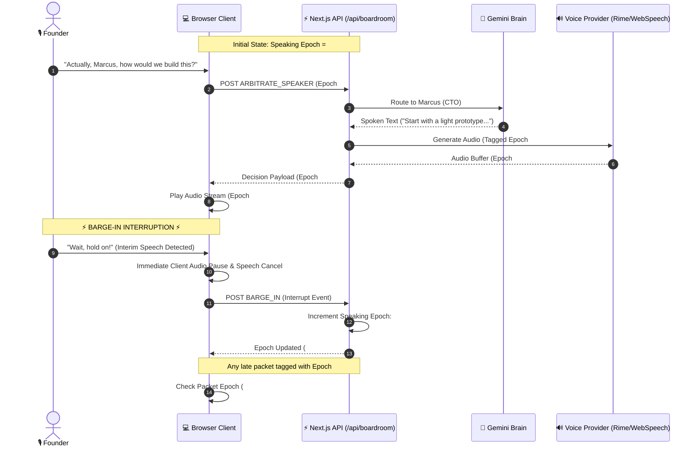
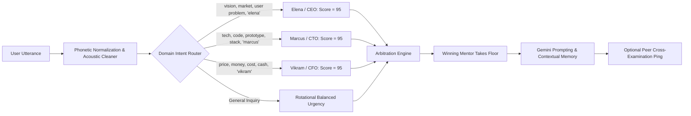
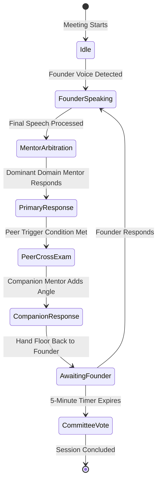

# 🏛️ Cavyn Architecture & System Blueprint

```
  ██████╗ █████╗ ██╗   ██╗██╗   ██╗███╗   ██╗
 ██╔════╝██╔══██╗██║   ██║╚██╗ ██╔╝████╗  ██║
 ██║     ███████║██║   ██║ ╚████╔╝ ██╔██╗ ██║
 ██║     ██╔══██║╚██╗ ██╔╝  ╚██╔╝  ██║╚██╗██║
 ╚██████╗██║  ██║ ╚████╔╝    ██║   ██║ ╚████║
  ╚═════╝╚═╝  ╚═╝  ╚═══╝     ╚═╝   ╚═╝  ╚═══╝
```

Cavyn is a voice-native multi-agent boardroom simulator and founder coaching environment. It hosts 3 autonomous AI mentors—**Elena (CEO / Product & Vision)**, **Marcus (CTO / Engineering & Tech)**, and **Vikram (CFO / Unit Economics & Monetization)**—coordinating real-time turn-taking, barge-in interruptions, peer cross-examination, and structured multi-party decision making.

---

## 1. High-Level System Architecture

```mermaid
flowchart TD
    subgraph Founder Experience
        F_MIC[Founder Microphone / Audio Input]
        F_UI[Next.js 16 Client & Wheel Interface]
        F_EARS[Founder Speakers / Headphones]
    end

    subgraph Browser Client Tier
        STT[Web Speech Continuous STT Engine]
        VAD[Instant Interim Speech Detector]
        AUDIO_CTRL[Audio Engine & Web Speech Synthesizer]
        STATE_STORE[React Boardroom State Store]
    end

    subgraph API Route & Orchestration
        API_GATEWAY[/api/boardroom]
        ORCHESTRATOR[Boardroom Orchestrator]
        ARBITER[Speaker Turn Arbiter & Priority Matrix]
        EPOCH_MGR[Monotonic Epoch Manager]
        CONTRADICTION_DET[Contradiction & Claim Tracker]
    end

    subgraph Intelligence Core
        GEMINI_CLIENT[Google Gemini 2.5 Flash Client]
        PERSONAS[Autonomous Mentor Personas Engine]
        PEER_DEBATE[Autonomous Cross-Examination Engine]
    end

    subgraph Voice Synthesis Core
        RIME_TTS[Rime TTS Cloud API - Coda / Mist v3]
        FALLBACK_TTS[Browser Natural Voice Synthesizer]
    end

    %% User Input Flow
    F_MIC -->|Continuous Stream| STT
    STT -->|Interim Speech Detected| VAD
    VAD -->|Barge-In Event| AUDIO_CTRL
    AUDIO_CTRL -->|Zero-Latency Audio Cancel| F_EARS
    VAD -->|POST BARGE_IN| API_GATEWAY
    STT -->|Final Utterance Completed| STATE_STORE
    STATE_STORE -->|POST ARBITRATE_SPEAKER| API_GATEWAY

    %% Server Processing Flow
    API_GATEWAY --> ORCHESTRATOR
    ORCHESTRATOR --> EPOCH_MGR
    ORCHESTRATOR --> CONTRADICTION_DET
    ORCHESTRATOR --> ARBITER
    ARBITER --> GEMINI_CLIENT
    GEMINI_CLIENT --> PERSONAS
    PERSONAS --> PEER_DEBATE

    %% Speech Dispatch Flow
    PEER_DEBATE --> RIME_TTS
    RIME_TTS -->|MP3 Audio Buffer| API_GATEWAY
    API_GATEWAY -->|Decision + Audio URL| STATE_STORE
    STATE_STORE -->|Validate Epoch| AUDIO_CTRL
    AUDIO_CTRL -->|Direct Stream| F_EARS
    AUDIO_CTRL -.->|Fallback on Buffer Delay| FALLBACK_TTS
    FALLBACK_TTS --> F_EARS

    %% UI Updates
    STATE_STORE --> F_UI
```

---

## 2. Monotonic Epoch Invalidation (Zero Stale Leaks)

The critical challenge in voice-driven multi-agent environments is **stale audio leakage**: when an agent is generating or streaming audio and the user interrupts, delayed audio packets can play over the user or desynchronize turn ownership.

Cavyn solves this deterministically using **Monotonic Epoch Arbitration**:



---

## 3. Autonomous Mentor Domain Routing & Priority Arbiter

The Arbitration Engine calculates a dynamic priority bid for each of the three mentors (**CEO**, **CTO**, **CFO**) based on the user's input, domain tags, direct address, and peer interaction:



### Domain Routing Matrix

| Mentor | Seat / Title | Primary Domains | Voice Profile | Key Responsibilities |
|---|---|---|---|---|
| **Elena** | `SEAT 01` / Lead Venture Partner | Market, User Problem, Narrative, Differentiation | Female (`amber`, Google US Natural, `pitch: 1.05`) | Explores user empathy, product positioning, and big-picture viability without corporate jargon. |
| **Marcus** | `SEAT 02` / Technical Advisor | Code, Infrastructure, App Flow, Tech Stack | Male (`cove`, Google US Natural, `pitch: 0.98`) | Guides early prototyping, developer tools, database, and scalability in simple, approachable terms. |
| **Vikram** | `SEAT 03` / Financial Mentor | Pricing, Cost, Revenue, Subscription, Unit Economics | Male (`marsh`, Google US Natural, `pitch: 0.94`) | Demystifies money, pricing strategy, customer acquisition, and cash flow in practical steps. |

---

## 4. Multi-Agent Cross-Examination Flow

When a mentor finishes their perspective or detects that a companion's domain is directly impacted (for instance, Marcus talking about server load which costs money, or Vikram asking if the feature is already built), they cross-examine autonomously:



---

## 5. Security & State Management Architecture

1. **In-Memory Volatile Encryption**:
   - API keys (`GEMINI_API_KEY`, `RIME_API_KEY`) can be loaded via `.env.local` or entered dynamically through the in-session Key Modal.
   - Keys are held securely in memory without persisting sensitive tokens to disk or database.
2. **Session State Store (`BoardroomSession`)**:
   - Maintains real-time claims, numeric contradictions, executive votes, event telemetry, and audio latency tracking.
3. **Phonetic Auto-Correction**:
   - Acoustic cleaner handles noisy mic inputs (e.g. converting `"turn manogies"` to `"terminologies"` or simplifying complex phrases into direct questions).
