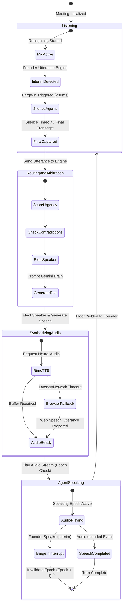
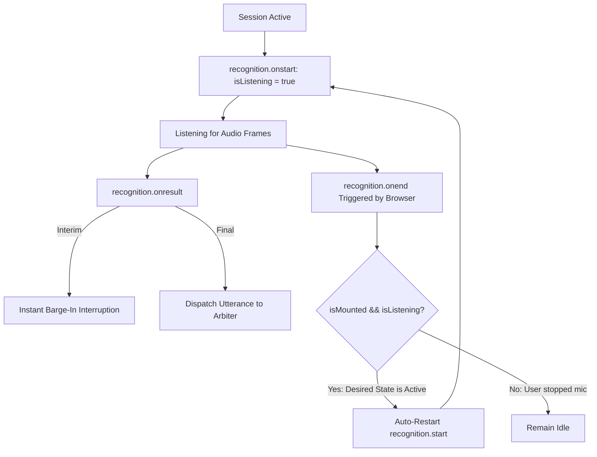

# 🎙️ Audio Engine, WebRTC/STT & Turn Arbitration

This document details Cavyn's real-time audio pipeline, turn arbitration engine, barge-in detection, and voice synthesis subsystems.

---

## 1. Real-Time Audio Lifecycle State Machine

---

## 2. Low-Latency Interruption ("Barge-In") Subsystem

### How Barge-In Works
When an AI mentor is speaking, the user's microphone remains continuously active (`continuous = true`, `interimResults = true`).

1. **Acoustic Detection**: The browser's Web Speech engine emits an `onresult` event with `interim` data within **15ms - 40ms** of the user starting to speak.
2. **Zero-Latency Client Silence**:
   - `audioRef.current.pause()` halts any playing HTML5 Audio element.
   - `audioRef.current.src = ''` unloads the buffer.
   - `window.speechSynthesis.cancel()` halts any active browser synthetic voice.
3. **Epoch Invalidation**:
   - Client sends `POST /api/boardroom` with `{ action: 'BARGE_IN' }`.
   - The server increments `session.speakingEpoch`.
   - Any currently generating speech chunks or in-flight API calls returning with the prior epoch are immediately dropped upon receipt.

### Latency Budget

```mermaid
gantt
    title Interruption Latency Breakdown (< 120ms total)
    dateFormat X
    axisFormat %s ms
    section Audio Pipeline
    Vocal Cord Energy to Mic       :0, 15
    STT Interim Frame Detection    :15, 45
    Client Audio Element Pause     :45, 50
    SpeechSynthesis Cancel         :50, 55
    Server Invalidation Handshake  :55, 95
```

---

## 3. Continuous Microphone Auto-Resilience Loop

Browser speech recognition (`webkitSpeechRecognition`) has a known limitation where network fluctuations or end-of-utterance silences can trigger `onend` and terminate the session. Cavyn implements an auto-resilience recovery loop:

---

## 4. Voice Synthesis: Cloud TTS vs. Local Natural Engines

Cavyn supports a dual-tier voice delivery model:

1. **Tier 1: Cloud Neural TTS (Rime Engine)**
   - Models: `coda` (Ultra-low latency conversational model) and `mist-v3`.
   - Speaker Mapping:
     - **Elena (CEO)**: `amber` (charismatic, warm, clear articulation)
     - **Marcus (CTO)**: `cove` (grounded, tech-focused, measured)
     - **Vikram (CFO)**: `marsh` (low-pitch, calm, thoughtful)
2. **Tier 2: Client Browser Natural Engine (Fallback & Local Mode)**
   - Dynamically probes the client system's `window.speechSynthesis.getVoices()`.
   - Filter criteria selects natural neural models (e.g. `Google US English`, `Natural`, `Samantha`, `Daniel`, `Rishi`).
   - Dynamically shapes **pitch** and **rate** per role:
     - Elena: `pitch = 1.05`, `rate = 1.0`
     - Marcus: `pitch = 0.98`, `rate = 1.02`
     - Vikram: `pitch = 0.94`, `rate = 0.98`
