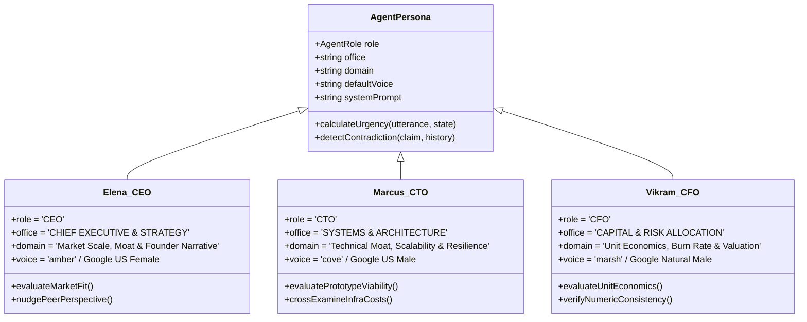
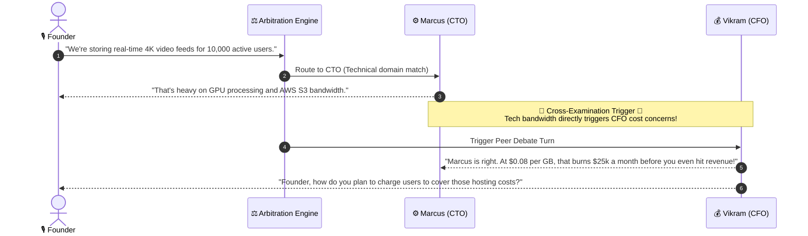

# 👥 Multi-Agent Personas, Domain Brains & Cross-Examination

This document provides a comprehensive breakdown of the three autonomous agents in Cavyn, their system prompts, decision models, voting heuristics, and peer debate mechanics.

---

## 1. Executive Matrix & Cognitive Profiles



---

## 2. Autonomous Mentor Specifications

### 👔 Elena Vance — Chief Executive Officer (`SEAT 01`)
- **Domain Focus**: Vision, customer pain points, storytelling, competition, and go-to-market.
- **Tone**: Warm, supportive, highly conversational, and forward-looking.
- **Trigger Keywords**: `market`, `user`, `customer`, `vision`, `problem`, `growth`, `founder`, `story`, `elena`.
- **Core Philosophy**: "If you can't describe who loves your product in 10 seconds, no amount of engineering will save it."

### ⚙️ Marcus Stone — Chief Technology Officer (`SEAT 02`)
- **Domain Focus**: System architecture, databases, codebases, development speed, and infrastructure.
- **Tone**: Pragmatic developer friend, grounded, candid, and demystifying.
- **Trigger Keywords**: `tech`, `code`, `app`, `build`, `prototype`, `database`, `stack`, `api`, `marcus`.
- **Core Philosophy**: "Don't over-engineer a spaceship when a simple bicycle solves the problem today."

### 💰 Vikram Rao — Chief Financial Officer (`SEAT 03`)
- **Domain Focus**: Unit economics, customer acquisition cost (CAC), lifetime value (LTV), pricing models, and cash runway.
- **Tone**: Clear, numbers-oriented without being intimidating, empathetic to early-stage realities.
- **Trigger Keywords**: `price`, `money`, `cost`, `burn`, `subscription`, `charge`, `revenue`, `vikram`, `margin`.
- **Core Philosophy**: "Price is a direct reflection of how much value you save or create for someone."

---

## 3. Autonomous Cross-Examination & Peer Debate Engine

Agents do not act in isolation. When one agent addresses a topic that impacts another domain, the system triggers a **Peer Cross-Examination Turn**:



---

## 4. End-of-Session Voting Heuristic

At the end of the 5-minute meeting (or when triggered manually), the committee casts independent votes:

```mermaid
flowchart TD
    CONCLUDE[Meeting Timer Reaches 0:00] --> VOTE_INIT[Initialize Committee Voting Protocol]
    
    subgraph Elena Evaluation
        E_IN[Product Vision, Founder Clarity, Market Size]
        E_EVAL[Evaluate: YES / NO / CONDITIONAL]
    end

    subgraph Marcus Evaluation
        M_IN[Technical Feasibility, Prototype Status, Execution Moat]
        M_EVAL[Evaluate: YES / NO / CONDITIONAL]
    end

    subgraph Vikram Evaluation
        V_IN[Pricing Viability, Burn Efficiency, Contradiction Count]
        V_EVAL[Evaluate: YES / NO / CONDITIONAL]
    end

    VOTE_INIT --> Elena Evaluation
    VOTE_INIT --> Marcus Evaluation
    VOTE_INIT --> Vikram Evaluation

    E_EVAL --> TALLY[Vote Tally & Consensus Calculation]
    M_EVAL --> TALLY
    V_EVAL --> TALLY

    TALLY --> DECISION{Tally >= 2 Positive Votes?}
    DECISION -->|Yes| APPROVE[Term Sheet Offered / Confetti Celebration 🎉]
    DECISION -->|No| REVISE[Revision Recommended / Mentorship Summary 📋]
```
